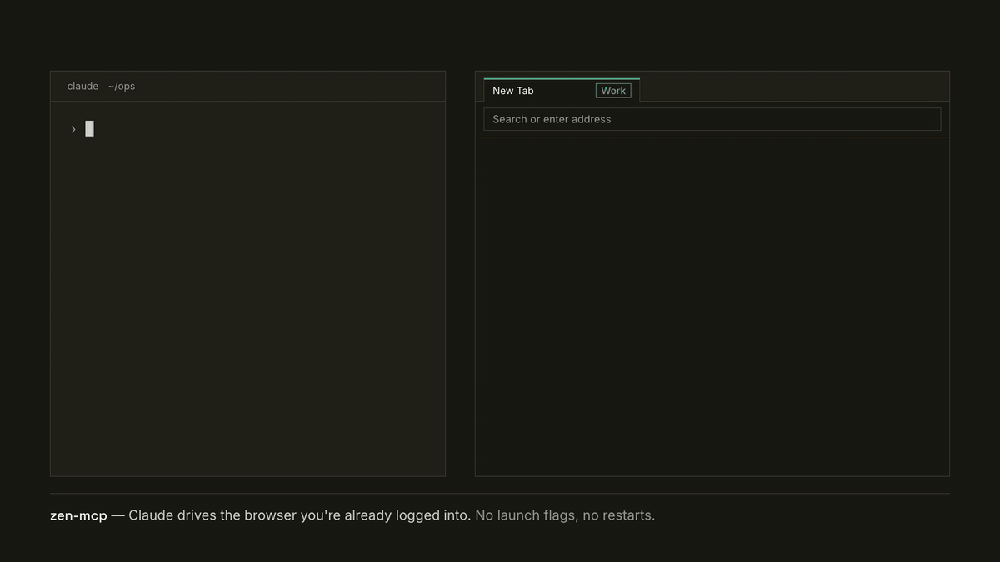

# zen-mcp

WebExtension-backed MCP for Zen / Firefox. It lives as a permanently-installed signed extension in your daily browser — **no launch flags, no restarts**, container scoping per MCP entry.



<sub>Illustrative UI with fake data: a generic browser and a fictional dashboard.</sub>

## Why

No launch flags and no restarts is the whole design premise. Marionette/WebDriver-based browser MCPs (including [`firefox-devtools-mcp`](https://github.com/mozilla/firefox-devtools-mcp), which this project once had a sibling fork of) reach further into the browser, but they require launching it with `--marionette`, so they can't drive the browser you already have open with all your sessions in it. This one trades that reach for actually being usable every day.

Use it when the automation has to happen **in your real browser** — authenticated dashboards, admin consoles, anything behind a login — or when you want several container-scoped MCP entries (`zen-cxv`, `zen-personal`, …) sharing one running browser that never gets interrupted.

```
Claude Code  --stdio-->  MCP server (per session, --container-scoped)
                              |
                              | ws://127.0.0.1:8766
                              v
                         daemon (long-lived router)
                              ^
                              | ws (token auth, 30s heartbeat)
                              |
                         MV3 extension (signed, in daily Zen)
```

## Quickstart

You need Node 20+, Zen (or stock Firefox), and a free [AMO](https://addons.mozilla.org) account to sign the extension. Every step below is expanded in [docs/install.md](docs/install.md).

**1. Build.**

```sh
git clone https://github.com/cxrobx/zen-mcp.git
cd zen-mcp
npm install
npm run build
```

**2. Start the daemon.** It writes the auth token to `~/.config/zen-mcp/auth.token` on first launch. To keep it running, use the launchd plist in [docs/install.md](docs/install.md#start-the-daemon).

```sh
node daemon/dist/index.js --port 8766
```

**3. Sign the extension** with AMO API credentials from https://addons.mozilla.org/en-US/developers/addon/api/key/ (one-time):

```sh
export AMO_KEY="user:1234567:42"
export AMO_SECRET="..."
npm run extension:sign
```

**4. Install it in Zen,** then in `about:addons` -> Zen Extension MCP Bridge -> **Permissions and data**, toggle **Access your data for all websites** ON (needed for `screenshot_page`).

```sh
open -a "/Applications/Zen.app" extension/web-ext-artifacts/d27cc...-X.Y.Z.xpi
```

**5. Connect the extension to the daemon.** In the extension's Preferences page, set **Daemon URL** to `ws://127.0.0.1:8766` and **Auth token** to the contents of:

```sh
cat ~/.config/zen-mcp/auth.token
```

The status pill should flip to `authenticated` within a few seconds.

**6. Register it in Claude Code:**

```sh
claude mcp add zen-ext -s user -- node /abs/path/to/zen-mcp/server/dist/index.js --port 8766
```

`claude mcp list` should report `✔ Connected`, which proves the daemon and extension are both up. Then ask for something only your signed-in browser can do, for example *"open my billing dashboard and tell me this month's total"*; the agent starts with `open_url`, which lands in the tab you already have open on that site.

## What it does

The current surface is **41 tools** (38 browser tools plus 3 local navigation-memory tools). Per-tab tools take a durable `tabId` (or a positional `pageIdx`; see [addressing tabs](docs/tools.md#addressing-tabs-tabid-vs-pageidx)).

| Bucket | Tools |
|---|---|
| **Containers** | `list_containers`, `container_routes`, `set_default_container`, `new_page_in_container` |
| **Pages** | `open_url`, `list_pages`, `new_page`, `navigate_page`, `select_page`, `close_page`, `navigate_history`, `screenshot_page` |
| **DOM read** | `take_snapshot`, `interactive_elements`, `clear_snapshot`, `resolve_uid_to_selector`, `evaluate_script`, `get_page_text`, `read_page`, `find_by_text`, `wait_for` |
| **DOM actions** | `click_by_uid`, `hover_by_uid`, `fill_by_uid`, `fill_form_by_uid`, `drag_by_uid_to_uid`, `click`, `hover`, `fill`, `fill_secret`, `type`, `drag`, `select_option`, `press_key`, `scroll` |
| **Goal navigation (Jev)** | `navigate_goal` |
| **Cookies/storage** | `get_cookies`, `set_cookies`, `clear_cookies`, `get_storage`, `set_storage`, `clear_storage` |
| **Diagnostics** | `get_firefox_info` |
| **Navigation memory** | `get_domain_playbook`, `nav_memory_stats`, `nav_memory_forget` |

- **Container routing.** A host → container table, plus per-directory defaults, decides which cookie jar a URL opens in, and `open_url` reuses the tab already open there. See [docs/container-routing.md](docs/container-routing.md).
- **Non-disruptive by default.** Tabs open in the background and tools act on a tab by id without focusing it, so an agent can drive one container while you browse in another.
- **`fill_secret`.** Fills a form field from a macOS Keychain secret by name, only into hosts it is bound to, so the value never enters the transcript.
- **`navigate_goal`.** Reaches a read-only destination with TypeSafe's Jev choosing each click, on opt-in hosts only. See [docs/jev.md](docs/jev.md).
- **Navigation memory.** Learns privacy-minimized structural notes about sites it has driven and injects them as advisory hints. See [docs/nav-memory.md](docs/nav-memory.md).

Input is synthetic (`isTrusted: false`), so popups, clipboard, file pickers and browser shortcuts are out of reach. The full list, and what to use instead, is in [docs/limitations.md](docs/limitations.md).

## Docs

| Doc | What's in it |
|---|---|
| [docs/install.md](docs/install.md) | Requirements, build, AMO signing, install gotchas, daemon launchd plist, nav-memory flags, container-scoped registration |
| [docs/tools.md](docs/tools.md) | Tool surface, `tabId` vs `pageIdx` and Zen workspaces, `fill_secret`, `interactive_elements`, `navigate_goal`, absent and deferred tools, fidelity gaps, focus behavior, Zen spaces |
| [docs/container-routing.md](docs/container-routing.md) | The `containers.json` format, accounts, consoles, `projects` directory defaults, matching, precedence, tab reuse, failure modes |
| [docs/limitations.md](docs/limitations.md) | What the MV3 sandbox puts out of reach, why Marionette was rejected, synthetic-input consequences |
| [docs/architecture.md](docs/architecture.md) | Multi-entry pattern, auth + heartbeat, what the daemon owns, snapshot caching |
| [docs/nav-memory.md](docs/nav-memory.md) | Navigation memory design, privacy controls, consolidation, operations |
| [docs/jev.md](docs/jev.md) | `navigate_goal` design, thresholds and measurements |
| [docs/development.md](docs/development.md) | Dev loop with `web-ext run`, test suites and live probes |
| [docs/troubleshooting.md](docs/troubleshooting.md) | Connection, permission, port and token problems |
| [CHANGELOG.md](CHANGELOG.md) | Release history |

## Security model

- Daemon binds 127.0.0.1 only. No remote network exposure.
- Auth token is the only thing that gates the extension's tool surface from other processes on the same machine. Treat it like any other local credential.
- The signed extension has `<all_urls>` host permission (gated behind explicit user opt-in for site-data access). It can therefore script any page you visit. Don't grant it lightly.
- `evaluate_script` runs arbitrary user-provided JS in the page's MAIN world. The MCP token gates who can call it. There is no per-tool permission check beyond auth.
- Navigation memory is privacy-minimized advisory state, not a proof that arbitrary PII can never occur. Defense comes from structural allowlists, two-stage redaction, local-only permissions, bounded retention, explicit purge controls, and deterministic planted-secret tests.

## License

MIT OR Apache-2.0
